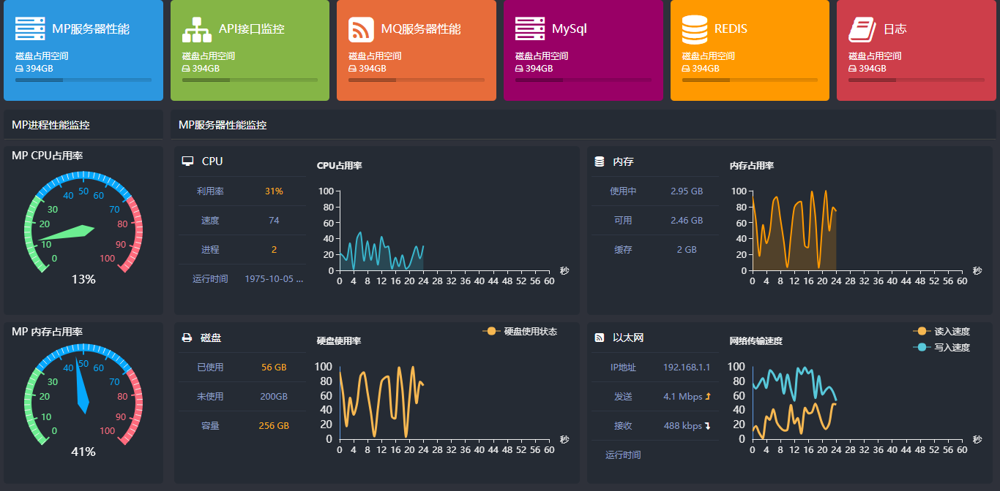
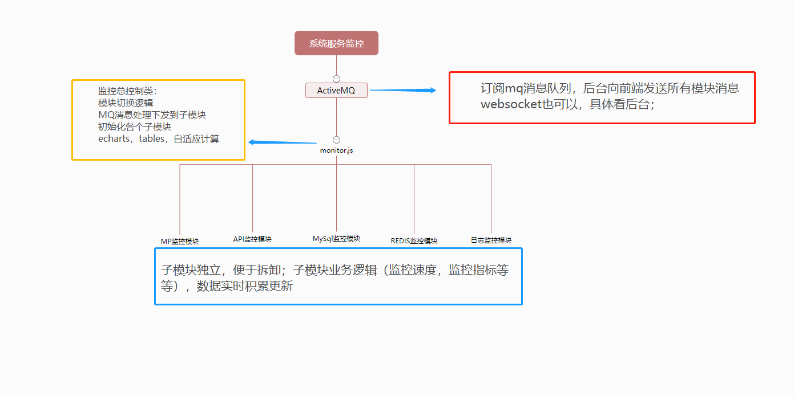

#系统服务实时监控

##一段刻骨铭心的开发历程

那是2017年年末，一个不怎么寒冷的冬天。头天刚加了个大夜，项目发版，我啃着北京10块钱一个的煎饼果子（还只加了个小肠，这TM是金子做的么！！），靠在椅子上看看掘金的技术贴，心想这发版成功了不得缓几天，下班约约朋友，吃着烤串唱着歌岂不是美滋滋啊。“骆飞，来一下。”项目经理的破锣嗓子给我吓一跳（又干啥，又咋了，又作啥妖）。

“有个项目需要你发挥一下，我可是很看好你哦！”经理喝口茶，一本正经（semimi）的看着我说。

“可以啊，你说吧。”我很（bu）高（qing）兴（yuan）的拿起了我的小本本。

“我们打算做一个系统监控系统，包括MP监控，接口监控，mysql监控，redis监控和日志监控，内部人员使用，观察系统的健康度和稳定性，来人参观也可以展示一下，所以要尽可能炫酷一点。”

“嗯，然后呢”我记完，抬头一脸期待的看着他。

“嗯？还然后啥？我说的还不够清楚吗？快去做吧，两周我要看结果，后台你自己挑人支持。”说完又继续看股票去了。

“开发文档呢？”

“自己写！”

“原型图呢？”

“自己画”

“我。。。。。”

“自己查去，我都很忙的”

。。。。。。
就这样，我接下了这个监控系统，我很佩服我自己的勇气和胆识，什么都不知道，什么都没有的情况下，我毅然决然的接下了这个任务（拉倒吧，你不接有办法吗？？）

但是我只是一个前端啊，只是一个简简单单的可爱切图仔。为什么要这么对我。。。。。妹啊！

心中纵使有万马奔腾，但活不能不干，毕竟为了生活。。。。。。

接下来的一段日子，就是墙里墙外各种搜索，各种学习，参照了微软的系统监控和监控宝上的监控指标，还有各种运维大牛的博客等等，拼凑出了一套完整并符合当前系统的监控指标。

然后就是设计界面了，不是要炫酷要美丽吗。

黑底花色，骚起来吧！

css3动画，飘起来吧！

动态echarts，炫起来吧！

去你的吧！

没有后台数据，那就mock模拟一下，考虑到性能，还有主页接受mq推送消息后下发到子模块，这里没有用iframe，用了underscore的模板引擎，最后我们得到了他。

当时给我最直观的感受就是-------舒服了（很幸福的舒服）。

##关于监控指标和前端系统架构

监控指标的话系统中各个模块都很清晰的写着，就不再啰嗦了，感兴趣的小伙伴可以自己摘出来，也可以在模块的模拟数据中看到，那里有详细的注释。

我们这里提到的系统架构，无关后台，怎么实现不用管，接口设计好，字段定好。学习经理‘我要，我要，’就可以啦，闲话不说直接上图吧。

##总结
年初从管廊转到周界就一直在忙着项目重构，现在重构完成，也是真真能歇一歇了。每天解决一些测试部的BUG就是学习了，顺便把自己在公司的项目整理了一遍。
整理时，想想当时开发时的困境，感慨良多，就想着写一写，不算什么技术文档，就算时给自己一个总结，也是自己成长的一个记录吧。
所以大神们，我们不喷，乖！

其实说来说去，这个项目其实是是烂尾了。前端虽然完成，数据结构，监控指标都定好了，但是后台实现的难度是我们没有预期到的。

windows和linux各项监控数据不一，速度不一，cpu多核监控难度，还有MQ的消息阻塞，前前后后换了6个后端，最后只完成了个简洁版的。由于项目组后续还有动作，所以到这里就不了了之了。

项目到这里也是画上了一个不完美的句号，结局虽然不是很完美，但是这段经历确实很宝贵的。

如果你认为你只是一个前端，那你真的只是一个可爱的切图仔。分配任务时，你可能会说这些超出了前端的范畴，做不了。你不做会有人做的，做完你才发现这些你也能做，甚至做的更好。

如果你认为你不单单是个前端，你可以PS，你可以设计，你可以写接口，你可以架构，可以承担起一个项目，影响一些人。
那你真的就不简单是一个切图仔，而是一个优秀的且合格的程序员。

还是要放好心态，勇于挑战。人生都已经这样优秀了，还能差到哪里去呢？

